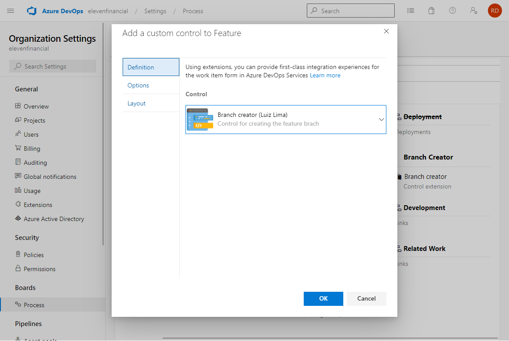
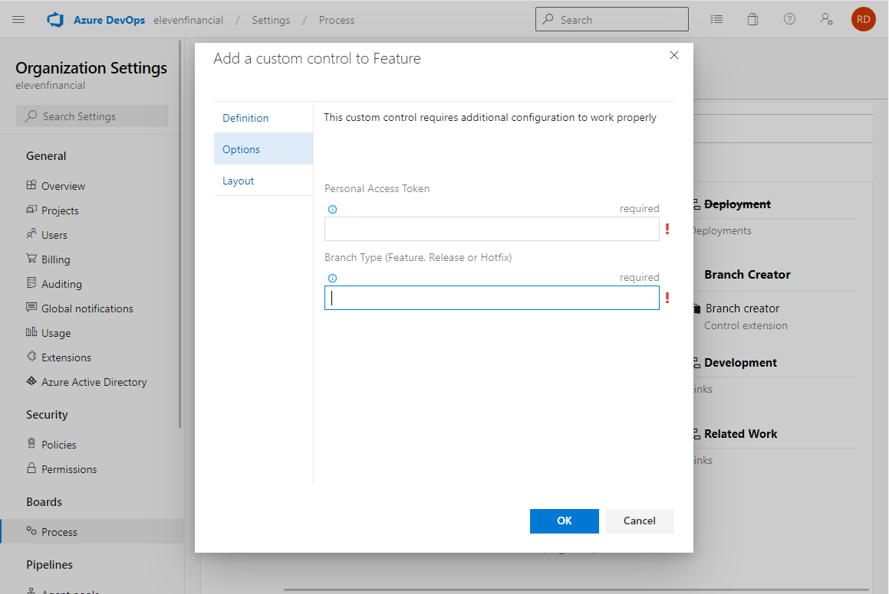
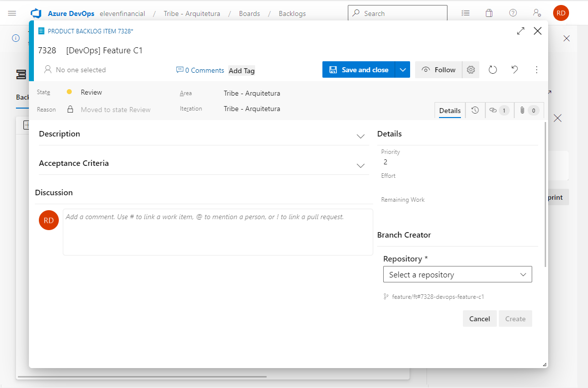
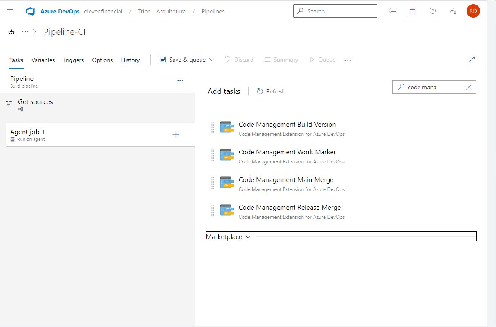
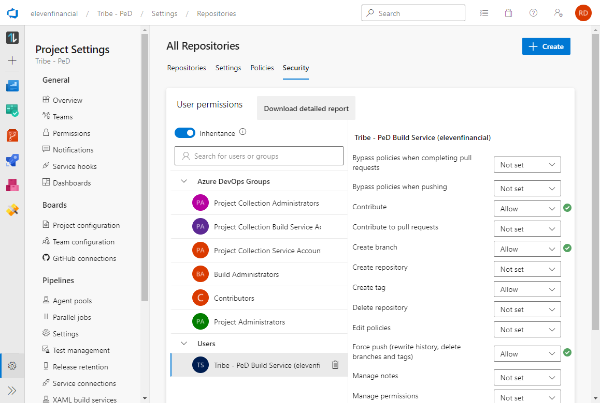

## **Code Management for Azure DevOps**

Designed to accelerate and standardize the creation of feature and release branches in Azure DevOps.

## **Features**

- Create branch feature, hotfix and release from Work Item.
- Create build version based pipeline variable.
- Create merge and tagging to selected branch, like main.
- Marker work item from related release branch, with comments, tag and change status.

## **Custom Control**

Add custom control in a work item type, to creating branches by according with your process.

Configure option custom control.

| Name                  | Description                                                           |
| --------------------- | --------------------------------------------------------------------- |
| Personal Access Token | Personal Access Token wil be used to run build and merges             |
| Branch Type           | Set the branch type (Feature, Release or Hotfix)                      |

## **Work Item**

To use custom control (Branch Creator), select a repository and create a new branch based from main with the same name of the task.

## **Custom Tasks**

This extension contains some custom task to used in pipelines. Explore each task for more options.

### **Requirements**

- For the process of creating a project, we use Azure Pipelines to perform tasks with git commands, so the permission of the user **"Build Service"** in each **Team Project** must have the following options to **Allow**.

- Contribute
- Create branch
- Force push

## **License**

Licensed under the MIT license. More information can be found by viewing the license [here](azure/license.md).